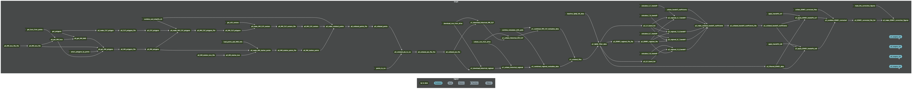

# Purpose

This script loads all necessary packages to run the targets pipeline, then runs it!

## Install necessary packages

Define package installer function

```{r package_installer}
package_installer <- function(x) {
  if (x %in% installed.packages()) {
    print(paste0('{', x ,'} package is already installed.'))
    } else {
      install.packages(x)
      print(paste0('{', x ,'} package has been installed.'))
    }
  }
```

List packages that need to be checked for install, and walk the function along them all.

```{r walk_package_installer}
packages <- c('tidyverse',
              'reticulate',
              'targets',
              'tarchetypes',
              'nhdplusTools',
              'polylabelr',
              'sf',
              'readxl')
lapply(packages, package_installer)
```

## Run the targets pipeline and output a network graph.

```{r run_targets}
library(targets)

# run the pipeline
tar_make()

```

### Create a network diagram of the workflow.

```{r write_mermaid}
# save the mmd file
writeLines(tar_mermaid(), sep = '\n', 'mermaid.mmd')
```

```{zsh create_mermaid_png}
mmdc -i mermaid.mmd -o mermaid.png -t dark -w 4000 -H 1000
```



In order to view [legible] text, right click the image and open in a new window.
